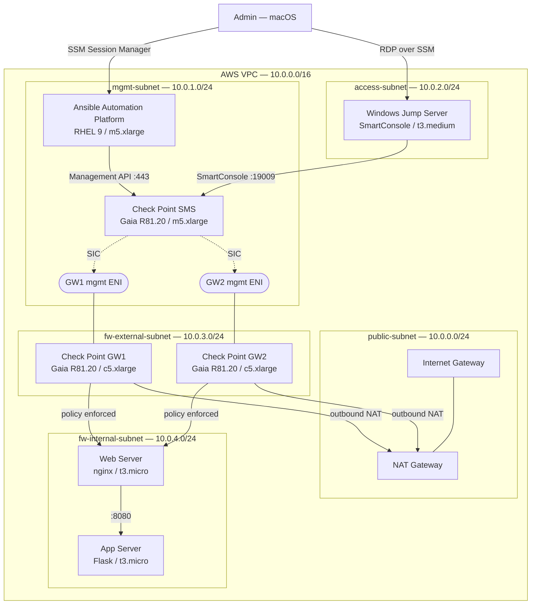

# Ansible + Check Point Firewall Demo — Architecture & Planning

> **Author:** Patrick Leathen | **Date:** March 2026 | **Version:** 0.3

A customer-facing demo showing how Red Hat Ansible Automation Platform (AAP) can create, modify, and delete Check Point firewall rules through versioned, repeatable playbooks. The environment runs entirely on AWS, is deployed via Terraform + Ansible, and can be torn down and redeployed within 7-day windows from this Git repository alone.

---

## Contents

1. [Executive Summary](#1-executive-summary)
2. [Target Architecture](#2-target-architecture)
3. [Infrastructure as Code Approach](#3-infrastructure-as-code-approach)
4. [Check Point Virtual Appliance Setup](#4-check-point-virtual-appliance-setup)
5. [Demo Scenarios](#5-demo-scenarios)
6. [Phased Implementation Plan](#6-phased-implementation-plan)
7. [Future State — AlgoSec & ServiceNow](#7-future-state--algosec--servicenow)
8. [Estimated AWS Costs](#8-estimated-aws-costs)
9. [Appendix](#appendix)

---

## 1. Executive Summary

This document defines the architecture, component choices, and IaC strategy for a repeatable demo environment. The demo showcases how Ansible Automation Platform can manage Check Point Next-Generation Firewalls — automating rule creation, modification, and deletion through code stored in this repository.

The environment is designed to be fully destroyed and redeployed on demand. A single `bash scripts/deploy.sh` brings everything up from scratch; `bash scripts/teardown.sh` returns the AWS bill to near-zero.

Check Point is deployed as imported **Gaia OS virtual appliances** (BYOL), avoiding any AWS Marketplace dependency and giving full control over versioning. AAP is deployed using a Red Hat trial subscription on a single-node RHEL 9 instance.

A future phase will introduce **AlgoSec** for policy risk analysis and **ServiceNow** for self-service firewall rule requests — building out a complete, enterprise-grade network security automation story.

---

## 2. Target Architecture

### 2.1 High-Level Design

The environment is divided into three logical tiers within a single AWS VPC:

- **Management Tier** — Ansible Automation Platform and the Check Point Security Management Server (SMS). Internal-only, no internet-facing exposure. The SMS runs on Gaia OS; SmartConsole (the GUI client) runs on the Windows jump server in the Access Tier.
- **Access Tier** — A Windows Server with SmartConsole installed, accessed via RDP tunnelled through AWS Systems Manager Session Manager. Used during demos to show policy changes being applied visually.
- **Firewall & Protected Tier** — Two Check Point gateways sitting inline between a simulated external network and a protected internal subnet hosting a simple two-tier demo application.

Access to all instances is via **AWS Systems Manager Session Manager** — no bastion host, no open SSH ports, no key management overhead. This is also worth a brief mention during the demo as a security posture point.

### 2.2 Network Design

| Subnet | CIDR | Hosts | Purpose |
|--------|------|-------|---------|
| `public-subnet` | `10.0.0.0/24` | NAT Gateway | Outbound NAT only |
| `mgmt-subnet` | `10.0.1.0/24` | SMS, AAP, GW mgmt ENIs | Management traffic only |
| `access-subnet` | `10.0.2.0/24` | Windows Jump Server | RDP-over-SSM for SmartConsole |
| `fw-external-subnet` | `10.0.3.0/24` | GW external interfaces | Simulated untrusted/internet-facing side |
| `fw-internal-subnet` | `10.0.4.0/24` | GW internal interfaces, demo app | Simulated protected/trusted network |

Each Check Point gateway has **three Elastic Network Interfaces**: external (`fw-external-subnet`), internal (`fw-internal-subnet`), and a dedicated management ENI (`mgmt-subnet`). Keeping management traffic on a separate interface ensures SIC between the SMS and gateways never needs to traverse the firewall itself — cleaner architecturally and simpler to automate.

### 2.3 Architecture Diagram



### 2.4 Component Summary

| Component | Technology | EC2 Size | OS |
|-----------|------------|----------|----|
| Ansible Automation Platform | Red Hat AAP 2.x (trial) | `m5.xlarge` | RHEL 9 |
| Check Point SMS | Gaia R81.20 (BYOL) | `m5.xlarge` | Gaia OS |
| Check Point Gateway 1 | Gaia R81.20 (BYOL) | `c5.xlarge` | Gaia OS |
| Check Point Gateway 2 | Gaia R81.20 (BYOL) | `c5.xlarge` | Gaia OS |
| Windows Jump Server | SmartConsole host | `t3.medium` | Windows Server 2022 |
| Web Server (demo app) | nginx | `t3.micro` | Amazon Linux 2 |
| App Server (demo app) | Python Flask | `t3.micro` | Amazon Linux 2 |

---

## 3. Infrastructure as Code Approach

### 3.1 Toolchain

- **Terraform** provisions all AWS resources: VPC, subnets, security groups, EC2 instances, Elastic IPs, ENIs, and IAM roles.
- **Ansible** handles everything above the OS: installing AAP, bootstrapping Check Point Gaia, establishing SIC, enabling the Management API, pushing the initial policy, and managing firewall rules during the demo.
- **Git** (this repository) is the single source of truth for all code and configuration.

### 3.2 Repository Structure

```
ansible-checkpoint-demo/
├── terraform/
│   ├── main.tf                   # VPC, subnets, security groups
│   ├── instances.tf              # EC2 instances & ENIs
│   ├── iam.tf                    # IAM roles (incl. vmimport for Gaia AMI creation)
│   ├── variables.tf              # AMI IDs (from SSM), region, instance sizes
│   ├── outputs.tf                # IPs passed to Ansible inventory
│   └── backend.tf                # S3 remote state config
├── ansible/
│   ├── inventory/
│   ├── group_vars/
│   │   └── all/
│   │       ├── vars.yml          # Non-sensitive variables
│   │       └── vault.yml         # Ansible Vault encrypted secrets
│   ├── playbooks/
│   │   ├── 01-configure-aap.yml
│   │   ├── 02-bootstrap-checkpoint.yml
│   │   ├── 03-establish-sic.yml
│   │   ├── 04-push-initial-policy.yml
│   │   └── demo/
│   │       ├── add-perimeter-rule.yml
│   │       ├── add-internal-rule.yml
│   │       ├── modify-rule.yml
│   │       ├── delete-rule.yml
│   │       ├── emergency-block.yml
│   │       └── reset-demo.yml
│   └── collections/
│       └── requirements.yml      # check_point.mgmt collection
├── scripts/
│   ├── deploy.sh                 # Full stack: terraform apply → ansible-playbook
│   ├── teardown.sh               # terraform destroy
│   ├── bootstrap-state.sh        # One-time S3 + DynamoDB setup (run once ever)
│   └── import-gaia-ami.sh        # Import Check Point OVA → custom AWS AMI
└── PLAN.md
```

### 3.3 Secrets Management

All secrets live in this repository but are encrypted. This is a useful talking point with customers: *"the entire environment, including credentials, is version-controlled — auditable, diffable, and rotatable through code."*

- **Ansible Vault** encrypts all sensitive variables (Check Point API credentials, SIC activation key, AAP admin password) in `group_vars/all/vault.yml`. Acceptable for demo use; production would use a dedicated secrets manager.
- **AWS SSM Parameter Store** holds any secrets needed at EC2 first-boot before Ansible is available (notably the SIC key, retrieved by the Gaia user-data script).
- **SSH key pairs**: public key in Git; private key in SSM Parameter Store.
- **Terraform remote state** is stored in S3 with DynamoDB locking. The S3 bucket and DynamoDB table are the only resources that must exist before running `terraform init` — `scripts/bootstrap-state.sh` creates them once and they persist permanently across 7-day cycles.

### 3.4 Deploy & Teardown

```bash
# One-time only — creates S3 + DynamoDB for Terraform state
bash scripts/bootstrap-state.sh

# One-time only — imports Check Point Gaia OVA and registers the AMI in SSM
bash scripts/import-gaia-ami.sh

# Full deploy (~30-45 minutes due to Gaia first-boot time)
bash scripts/deploy.sh

# Teardown — cost drops to near-zero
bash scripts/teardown.sh

# Reset between customers (seconds via the Check Point API)
ansible-playbook ansible/playbooks/demo/reset-demo.yml
```

---

## 4. Check Point Virtual Appliance Setup

Check Point is deployed as imported Gaia OS virtual appliances rather than from AWS Marketplace, giving full control over the Gaia version and removing any Marketplace subscription dependency. The same imported AMI is used for all three Check Point instances (SMS and both gateways) — the role is determined by the first-time wizard options applied during bootstrap.

### 4.1 Importing the Gaia AMI

1. Download the **Gaia R81.20 OVA** from the [Check Point UserCenter](https://supportcenter.checkpoint.com). A UserCenter account is required.
2. Upload to S3 and import via `scripts/import-gaia-ami.sh`, which wraps the AWS VM Import/Export process:
   ```bash
   aws s3 cp Check_Point_R81.20_Gaia.ova s3://<state-bucket>/images/
   aws ec2 import-image --description "Gaia R81.20" \
     --disk-containers "Format=OVA,UserBucket={S3Bucket=<state-bucket>,S3Key=images/Check_Point_R81.20_Gaia.ova}"
   ```
   The import takes 15–30 minutes. The resulting AMI ID is written to SSM Parameter Store; Terraform resolves it from there automatically — it is never hard-coded.
3. The `vmimport` IAM role required by VM Import/Export is created by `terraform/iam.tf` and present before the script runs.

### 4.2 Check Point Licences

Running Gaia as a BYOL instance requires a valid Check Point licence. For this demo, request a **90-day evaluation licence** through your Check Point partner or sales contact. The licence is applied to the SMS during bootstrap and pushed to the gateways — it is not tied to the AMI.

### 4.3 SIC (Secure Internal Communication)

SIC is the one-time trust establishment between the SMS and each gateway. It is fully automated:

**On each gateway**, EC2 user-data runs a `clish` script at first boot to set the SIC activation key, pulling the key from SSM Parameter Store:

```bash
clish -c "set sickey $(aws ssm get-parameter \
  --name /demo/checkpoint/sic_key --with-decryption \
  --query 'Parameter.Value' --output text)"
clish -c "save config"
```

**On the SMS**, `ansible/playbooks/03-establish-sic.yml` uses the `cp_mgmt_simple_gateway` module to add each gateway, passing the same key:

```yaml
- name: Add gateway to SMS
  check_point.mgmt.cp_mgmt_simple_gateway:
    name: "{{ gateway_name }}"
    ip_address: "{{ gateway_mgmt_ip }}"
    one_time_password: "{{ vault_sic_key }}"
    state: present
```

The SIC key is stored in Ansible Vault (`vault.yml`) and in SSM Parameter Store. The playbook includes a wait/poll task to confirm each gateway is reachable on its management ENI before attempting SIC.

### 4.4 Management API

The Check Point Management API (HTTPS, port 443) is not enabled by default. `ansible/playbooks/02-bootstrap-checkpoint.yml` enables it via `cpconfig` in batch mode and restricts access to the AAP server's IP. This is a required step before any `check_point.mgmt` Ansible module can function.

---

## 5. Demo Scenarios

Each scenario maps to an AAP job template with a **Survey prompt** — source, destination, port, and rule name are entered in a form before clicking Launch. No Ansible or firewall knowledge is required from the audience.

The demo application is a two-tier setup: an nginx web server and a Python Flask app server, both in the protected subnet. This allows the demo to show both perimeter rules (external → web server) and inter-zone rules (web server → app server), which is far more representative of real enterprise environments than a single host.

Keep **SmartConsole open on the Windows box throughout the demo** with the SmartLog tab visible. As rules are added and removed, the audience sees live traffic logs changing in real time — no terminal output required.

### Scenario 1 — Create a Perimeter Rule

**Setup:** Attempt to reach the web server — it fails. SmartLog shows the drop.

**Action:** Launch "Add Perimeter Rule" in AAP. Ansible creates the network objects and access rule, publishes, and installs the policy to both gateways.

**Outcome:** Traffic succeeds. SmartLog shows the allow. SmartConsole shows the new rule and both gateways marked as up to date.

**Talking point:** *"This same playbook manages 5 firewalls or 500. The change is a Git commit — who made it, when, and why is a permanent record."*

---

### Scenario 2 — Add an Inter-Zone Rule

**Setup:** The web server is reachable but the application returns an error — it cannot reach the app server on port 8080.

**Action:** Launch "Add Internal Rule." Source: `WebServers` object. Destination: `AppServers` object. Port: 8080.

**Outcome:** The application works end-to-end. Two rules, two policy decisions, one pipeline.

**Talking point:** *"Perimeter and east-west segmentation, managed through the same automation. This is what network policy as code looks like."*

---

### Scenario 3 — Tighten an Overly Permissive Rule

**Setup:** The perimeter rule allows traffic from `any` source. Flag this as a finding.

**Action:** Launch "Modify Rule." The Survey presents the current source value and prompts for a replacement subnet.

**Outcome:** SmartConsole shows the tightened rule. The overly permissive source is gone.

**Talking point:** *"No change window, no CLI access, no ticket queue. A governed change in under a minute — with a full audit trail."*

---

### Scenario 4 — Emergency Block

**Setup:** An IP is generating suspicious traffic and needs to be blocked immediately.

**Action:** Launch "Emergency Block." Survey prompt asks for the IP. Ansible creates a drop rule at the top of the policy and installs it.

**Outcome:** Traffic from that IP is blocked on both gateways within seconds. SmartLog confirms the drops.

**Talking point:** *"Same tool, same process, same audit trail — whether it's routine provisioning or an incident response action."*

---

### Scenario 5 — Reset Demo Baseline

**Action:** Run `reset-demo.yml` (or launch the "Reset Demo" job template). Deletes all demo rules and objects, reinstalls the clean baseline policy.

**Outcome:** Environment is clean in seconds. No redeploy needed between customers.

---

## 6. Phased Implementation Plan

| Phase | Focus | Key Deliverables | Effort |
|-------|-------|-----------------|--------|
| **Phase 0** | Prerequisites | AWS account ready, IAM permissions in place, Gaia OVA downloaded from UserCenter, AMI imported and registered in SSM, Check Point eval licence obtained, AAP installer bundle in S3, S3/DynamoDB state bootstrap complete | 1 day |
| **Phase 1** | AWS Infrastructure | VPC, subnets, security groups, EC2 instances, ENIs (3 per gateway), Elastic IPs, SSM access confirmed for all instances | 2–3 days |
| **Phase 2** | Check Point Bootstrap | Gaia first-time wizard automated via user-data, SIC established for both gateways, Management API enabled, SmartConsole connecting from Windows box, initial policy package installed | 2–3 days |
| **Phase 3** | AAP Configuration | AAP installed, `check_point.mgmt` collection deployed, inventory and credentials configured, five demo job templates with Survey prompts created and tested | 2 days |
| **Phase 4** | Demo Hardening | All five scenarios tested end-to-end, reset playbook validated, `deploy.sh` and `teardown.sh` tested from a clean AWS account, demo script written | 1–2 days |
| **Phase 5** | AlgoSec Integration | AlgoSec AFA deployed (eval licence required), integrated with Check Point SMS, Ansible playbooks extended with a risk analysis gate before each rule push | 1–2 weeks |
| **Phase 6** | ServiceNow Self-Service | ServiceNow PDI configured, firewall rule request catalogue item built, AAP triggered via webhook on ticket approval, full ITSM-to-firewall loop demonstrated | 2–3 weeks |

---

## 7. Future State — AlgoSec & ServiceNow

### 7.1 Adding AlgoSec

AlgoSec Firewall Analyzer (AFA) integrates directly with the Check Point SMS to provide continuous policy analysis, risk assessment, and compliance reporting. In the enhanced demo:

1. A rule change is initiated (from AAP in Phase 5, or ServiceNow in Phase 6)
2. Before pushing, an Ansible task calls the AlgoSec API: *"Does this rule violate any security baseline or open unintended access paths?"*
3. If AlgoSec flags a risk, the playbook halts — no change is made
4. If clean, the playbook proceeds; AlgoSec picks up the policy change from the SMS and updates its compliance reports automatically

This is a compelling story for regulated industries where risk gating and change auditability are mandatory controls. An AlgoSec lab/NFR licence is typically available through the partner programme.

### 7.2 Adding ServiceNow

ServiceNow provides the self-service front door:

1. User submits a **Firewall Rule Request** via the Service Catalogue (source, destination, port, business justification)
2. Request routes through an approval workflow (manager → security team)
3. On approval, ServiceNow triggers AAP via a REST API webhook, passing rule parameters as variables
4. AAP runs the playbook: AlgoSec risk check → rule creation → policy push → verification
5. AAP reports the outcome back to ServiceNow, closing the ticket with full details

A free **ServiceNow Personal Developer Instance (PDI)** is available at [developer.servicenow.com](https://developer.servicenow.com). A scripted REST message or IntegrationHub step handles the AAP webhook call.

---

## 8. Estimated AWS Costs

Indicative costs for `eu-west-1`, on-demand pricing, all instances running 24/7. BYOL eliminates the Check Point Marketplace hourly fees.

| Component | Instance | Est. $/hr | 7-day cost |
|-----------|----------|-----------|-----------|
| AAP Server (RHEL 9) | `m5.xlarge` | ~$0.24 | ~$40 |
| Check Point SMS (Gaia, BYOL) | `m5.xlarge` | ~$0.19 | ~$32 |
| Check Point Gateway x2 (BYOL) | `c5.xlarge` x2 | ~$0.17 x2 | ~$57 |
| Windows Server 2022 | `t3.medium` | ~$0.07 | ~$12 |
| Web Server + App Server | `t3.micro` x2 | ~$0.01 | ~$4 |
| NAT Gateway + Transfer + EBS | — | ~$0.05 | ~$20 |
| **Total (24/7 running)** | | **~$0.90/hr** | **~$165** |

**Cost optimisation:** `teardown.sh` drops persistent cost to ~$0.02/month (S3 only). Stopping instances overnight without destroying reduces cost by ~60% while preserving all configuration.

---

## Appendix

### Ansible Collection

`ansible/collections/requirements.yml`:

```yaml
collections:
  - name: check_point.mgmt
    version: ">=5.0.0"
```

```bash
ansible-galaxy collection install -r ansible/collections/requirements.yml
```

### Key Modules

| Module | Purpose |
|--------|---------|
| `cp_mgmt_login` / `cp_mgmt_logout` | Session management |
| `cp_mgmt_access_rule` | Create / modify / delete access rules |
| `cp_mgmt_network` | Manage network objects |
| `cp_mgmt_simple_gateway` | Add a gateway to the SMS (SIC establishment) |
| `cp_mgmt_service_tcp` / `cp_mgmt_service_udp` | Manage service objects |
| `cp_mgmt_publish` | Publish pending changes |
| `cp_mgmt_install_policy` | Install policy to gateways |

### Reference Links

- [check_point.mgmt on Ansible Galaxy](https://galaxy.ansible.com/ui/repo/published/check_point/mgmt/)
- [Check Point Management API Reference (R81.20)](https://sc1.checkpoint.com/documents/R81.20/WebAdminGuides/EN/CP_R81.20_ManagementAPIReferenceGuide/Topics-MAPI-Guide/MAPI-Overview.htm)
- [Check Point UserCenter](https://supportcenter.checkpoint.com)
- [AWS VM Import/Export](https://docs.aws.amazon.com/vm-import/latest/userguide/vmimport-image-import.html)
- [AWS SSM Session Manager — RDP tunnelling](https://docs.aws.amazon.com/systems-manager/latest/userguide/session-manager-working-with-sessions-start.html)
- [ServiceNow Personal Developer Instance](https://developer.servicenow.com/dev.do)
- [Ansible Vault](https://docs.ansible.com/ansible/latest/vault_guide/index.html)

---

*All costs are estimates. Check Point, Red Hat, AlgoSec, and ServiceNow are trademarks of their respective owners.*
